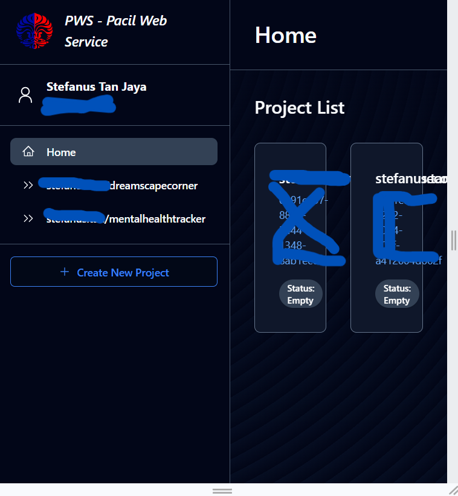
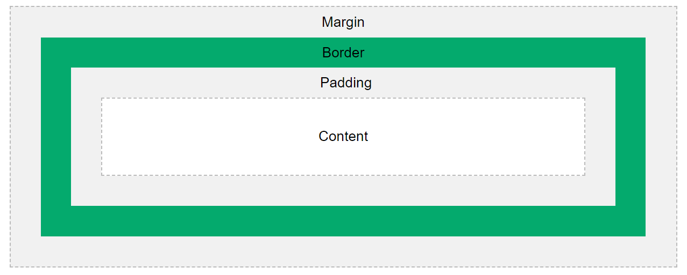
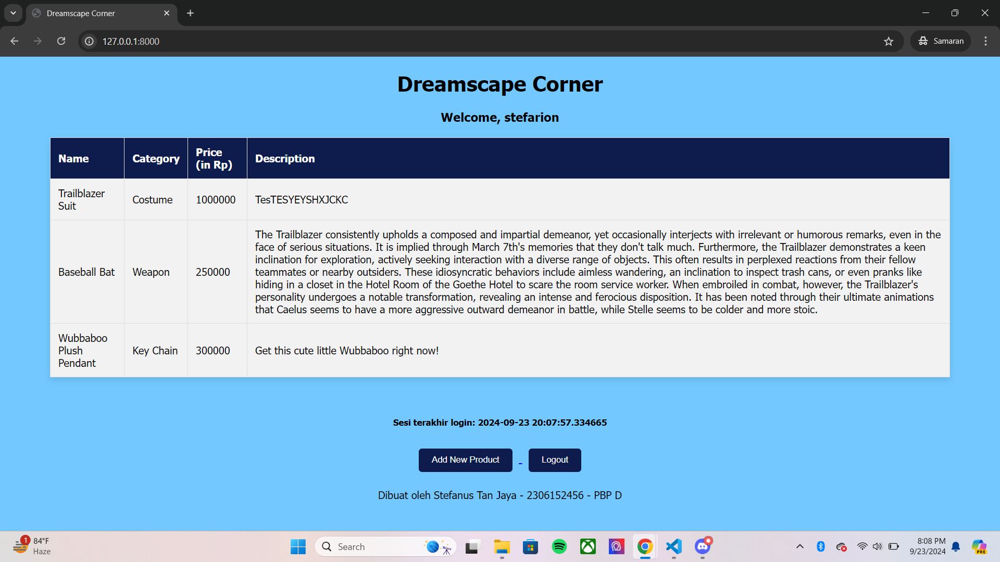
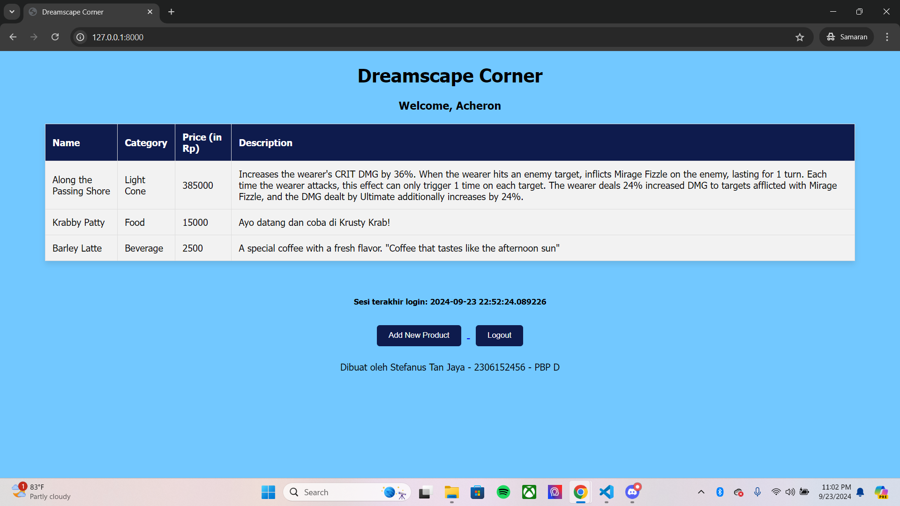
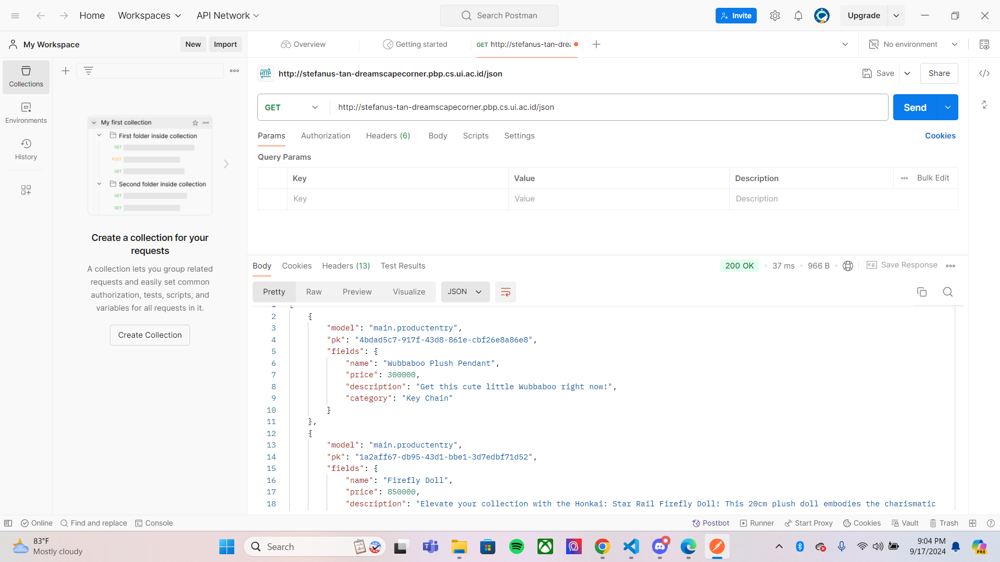
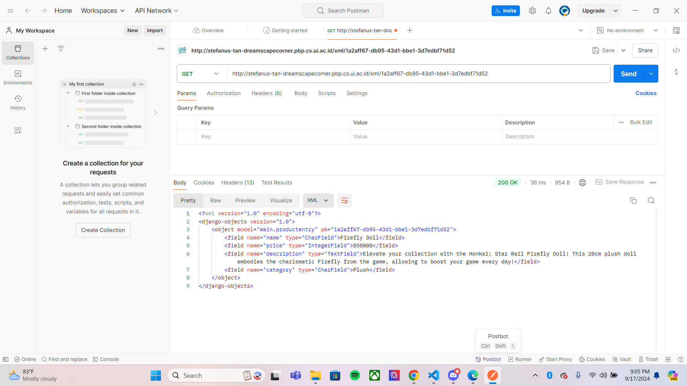
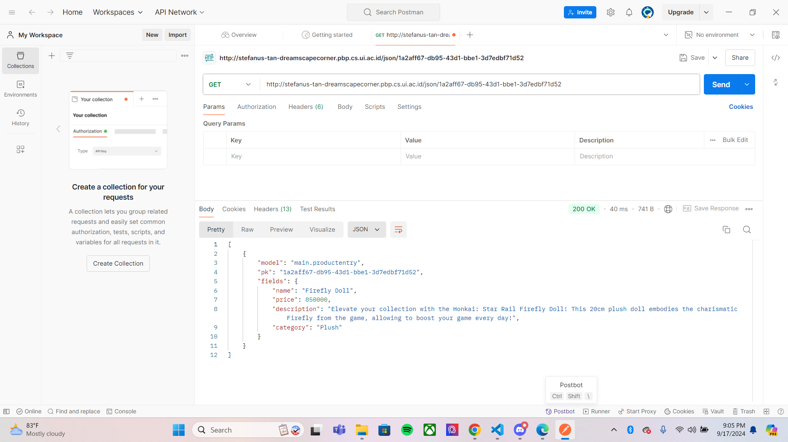
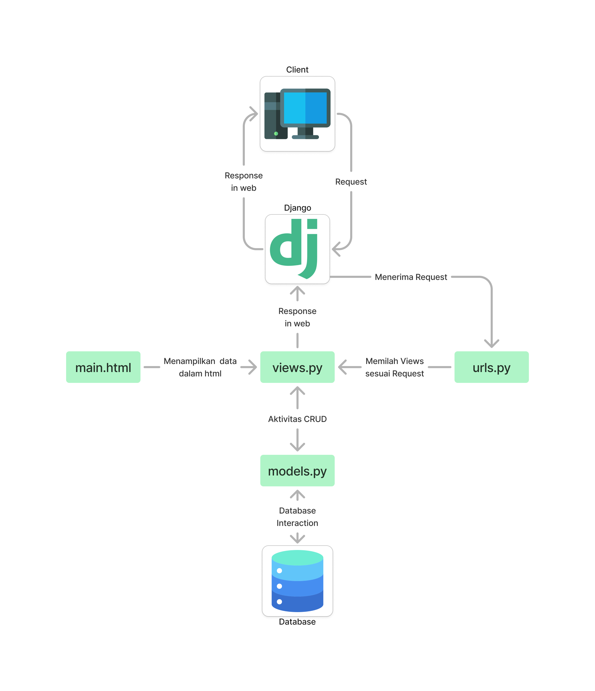

#  Dreamscape Corner
Dreamscape Corner adalah E-Commerce yang menyediakan produk merchandise dari Honkai: Star Rail. E-Commerce ini terinspirasi dari Honkai Shop yang juga menjual merchandise game yang sama. Nama "Dreamscape Corner" di ambil dari nama toko di dalam game bernama "Dreamscape Sales Store" yang terletak di Penacony.
<br>
<br>
Dreamscape Corner dijalankan menggunakan Pacil Web Service (PWS) yang dapat diakses melalui [link berikut.](http://stefanus-tan-dreamscapecorner.pbp.cs.ui.ac.id/ "Dreamscape Corner")<br>
Daftar Tugas Individu yang telah dikerjakan dapat dilihat di bawah ini.
+ [Tugas 2 Individu](https://github.com/stefarion/dreamscape-corner?tab=readme-ov-file#tugas-individu-2)
+ [Tugas 3 Individu](https://github.com/stefarion/dreamscape-corner?tab=readme-ov-file#tugas-individu-3)
+ [Tugas 4 Individu](https://github.com/stefarion/dreamscape-corner?tab=readme-ov-file#tugas-individu-4)
+ [Tugas 5 Individu](https://github.com/stefarion/dreamscape-corner?tab=readme-ov-file#tugas-individu-5)
+ [Tugas 6 Individu](https://github.com/stefarion/dreamscape-corner?tab=readme-ov-file#tugas-individu-6)
<br>

Dibuat oleh,<br>
**Nama:** Stefanus Tan Jaya<br>
**NPM:** 2306152456<br>
**Kelas:** PBP D<br>
<br>
<br>

# Tugas
## Tugas Individu 6
### a. Manfaat JavaScript dalam pengembangan aplikasi *web*
JavaScript adalah bahasa pemrograman ringan yang dirancang untuk menambah interaktivitas ke halaman *web*. JavaScript sering digunakan karena memungkinkan *developer* untuk membuat aplikasi *web* yang dinamis dan responsif serta dapat memberikan umpan balik secara *real-time*. Selain itu, bahasa ini terbilang mudah dipelajari dan didukung komunitas yang besar dan informatif. <br>

Beberapa manfaat JavaScript dalam pengembangan *web*, antara lain
1. Interaksi dinamis dari sisi pengguna.
2. Kecepatan eksekusi yang baik karena dijalankan langsung pada *browser* pengguna, sehingga menghemat *bandwidth* dan interaksi yang cepat.
3. Pemanggilan data secara asinkronus dengan menggunakan AJAX maupun Fetch API, sehingga data dapat diambil dan diperbarui tanpa harus *refresh web page*.

### b. Fungsi penggunaan `await` dalam `fetch()`
Fungsi `fetch()` sendiri berguna untuk membuat *request* HTTP. Bila ditambah `await`, *web* dapat bekerja secara asinkronus untuk menangani respon *request*. Fungsi dari penggunaan `await` adalah untuk membuat kode menunggu sampai `Promise` yang dihasilkan `fetch()` selesai, baru melanjutkan ke baris kode berikutnya. `Promise` adalah operasi pengambilan atau *fetching* data dari server yang biasanya membutuhkan waktu. <br>

Jika tidak menggunakan `await`, `fetch()` akan tetap berjalan melanjutkan ke baris kode berikutnya tanpa menunggu *fetching* data selesai. Akibatnya, hasil yang dikembalikan hanya berupa `Promise`, bukan data yang diinginkan. Contoh kasusnya bisa dilihat di bawah ini, di mana proses *fetching* belum selesai, sehingga yang dikembalikan adalah `Promise`.
```
function getData() {
    const response = fetch('https://noawait.com/data');
    console.log(response); // akan mencetak Promise, bukan data yang diinginkan
}
```

### c. Penggunaan *decorator* `csrf_exempt` pada *view* yang digunakan untuk AJAX `POST`
*Decorator* `csrf_exempt` berfungsi untuk menonaktifkan sementara proteksi CSRF (Cross-Site Request Forgery). Bila digunakan, artinya kita menonaktifkan proteksi CSRF untuk *view* tertentu. Sebenarnya, Django otomatis mengaktifkan proteksi CSRF untuk semua permintaan `POST`, `PUT`, atau permintaan yang memodifikasi data, misalnya dengan mengharuskan pengiriman token CSRF sebagai bagian dari *form* pada *request*. Tanpa token CSRF, Django akan memblokir permintaan `POST` karena dianggap tidak aman.


### d. Alasan pembersihan data *input* juga dilakukan di *backend*


### e. Proses Implementasi JavaScript dan AJAX


## Tugas Individu 5
### a. Urutan Prioritas CSS Selector
CSS Selector digunakan untuk mencari suatu elemen pada HMTL untuk diberikan *style*. Ada berbagai macam Selector dan CSS sudah mengatur skala prioritas untuk Selector tersebut, di antaranya
1. ***Inline styles*** memiliki prioritas tertinggi.
    ```
    <p style="color: red;">Tes merah</p>
    ```
2. **ID selector** memiliki prioritas kedua, di atas Class selector.
    ```
    #main-title {
        font-size: 20px;
    }
    ```
3. **Class selector** memiliki prioritas di bawah Class selector dan di atas Tag selector
    ```
    .button {
        color: blue;
    }
    ```
4. **Elemen/Tag selector** memiliki prioritas terendah.
    ```
    h1 {
        color: red;
    }
    ```
5. Deklarasi `!important` atau Important Rule merupakan sebuah pengecualian, di mana akan menghiraukan semua urutan sebelumnya dan langsung diutamakan.
    ```
    p {
        color: blue !important;
    }
    ```

### b. Alasan *responsive design* penting dalam pengembangan aplikasi *web*
Pada dasarnya, *responsive design* adalah cara menyusun *web* dengan HTML, sehingga *web* secara otomatis menyesuaikan skala konten dan elemennya dengan ukuran layar yang diterapkan untuk melihat *web* tersebut. Tujuan utamanya adalah supaya *user* dapat mengakses *web* dari perangkat apa saja (komputer, tablet, dan *smartphone*) dan tetap mendapatkan pengalaman yang nyaman dan maksimal saat menggunakan *web* tersebut. <br>

Beberapa keuntungan menerapkan *responsive design* pada *web* antara lain
1. Meningkatkan *user-experience* di berbagai perangkat.
2. Meningkatkan SEO (Search Engine Optimization) karena *search engine* seperti Google lebih merekomendasikan *web* yang memberikan pengalaman yang lancar di semua perangkat.
3. Kemudahan pemeliharaan *web* dengan menghilangkan pengelolaan beberapa versi *web* untuk perangkat yang berbeda.
4. Jangkauan analisis lebih luas karena mendapat *feedback* dari berbagai perangkat yang digunakan *user*. <br>

Contoh aplikasi yang mudah ditemui dan sudah menerapkan *responsive design* adalah Google yang sudah responsif di berbagai perangkat, bahkan *smart TV* sekalipun. Contoh aplikasi yang belum menerapkan *responsive design* adalah `https://pbp.cs.ui.ac.id/web/` yang dapat dilihat pada foto di bawah <br>


### c. Perbedaan antara *margin*, *border*, dan *padding* serta cara mengimplementasikannya
Secara singkat, ***margin*** merupakan ruang di luar elemen, yaitu mengelilingi *border*. ***Border*** merupakan garis yang mengelilingi elemen, termasuk *padding* dan konten. ***Padding*** merupakan ruang di dalam elemen yang memisahkan konten dengan *border*. Implementasinya seperti berikut
```
div {
    margin: 10px;
    border: 2px solid black;
    padding: 3px;
}
```
Ilustrasinya seperti berikut


### d. Konsep *flexbox* dan *grid layout* serta kegunaannya
***Flexbox*** adalah metode *layout* elemen dalam satu dimensi, baik secara horizontal maupun vertikal. *Flexbox* bekerja paling baik ketika kita perlu menyusun berbagai elemen dalam satu baris atau kolom dan mendistribusikan ruang secara fleksibel di antara elemen-elemen tersebut. Kegunaan *flexbox*, yaitu
1. Menyusun elemen dalam satu baris atau kolom secara fleksibel.
2. Menerapkan responsivitas pada elemen sesuai ukuran *web* yang berlaku.
3. Cocok untuk bagian spesifik pada *web*, seperti *navigation bar*, *header*, dan lain-lain. <br>

***Grid layout*** adalah metode layout elemen dalam dua dimensi yang bekerja seperti tabel, yaitu menyelaraskan elemen-elemen ke dalam baris dan kolom. *Grid layout* memungkinkan kita mengatur *layout web* yang lebih kompleks. Kegunaan *grid layout*, yaitu
1. Menyusun elemen dalam dua dimensi, yaitu baris dan kolom secara bersamaan.
2. Memungkinkan kontrol yang lebih besar dan presisi dalam mengatur *layout* elemen pada *web*.
3. Cocok untuk mengatur *layout web page* yang lebih besar dan kompleks.

### e. Proses Implementasi Edit & Delete Product serta Desain Web dengan Tailwind
1. Buat *file* `global.css` di dalam `static/css` pada *root directory* untuk memberi *style form* di semua *file* yang menggunakan *form* (`register.html`, `create_product_entry.html`, `edit_product.html`).
    ```
    .form-style form input, form textarea, form select {
        width: 100%;
        padding: 0.5rem;
        border: 2px solid #0e1b4d;
        border-radius: 0.375rem;
    }
    .form-style form input:focus, form textarea:focus, form select:focus {
        outline: none;
        border-color: #0e1b4d;
        box-shadow: 0 0 0 1px #0e1b4d;
    }
    ```
2. Edit `base.html` supaya *web* dapat menggunakan Tailwind *styling* dan mengimplementasikan `global.css`.
    ```
    
    <!DOCTYPE html>
    <html lang="en">
    <head>
        <meta charset="UTF-8" />
        <meta name="viewport" content="width=device-width, initial-scale=1.0" />
         
        <script src="https://cdn.tailwindcss.com"></script>
        <link rel="stylesheet" href=""/>
    </head>

    <body style="background-color: #72c8ff;">
         
    </body>
    </html>
    ```
3. Edit tampilan `login.html` dengan menambahkan beberapa gambar (satu gambar dijadikan *background*), mengatur kontainer untuk *login form*, dan memosisikan gambar ketika ukuran *page* diperkecil.
    ```
    ···
    
    <div class="min-h-screen flex items-center justify-center w-screen py-12 px-4 sm:px-6 lg:px-8 relative bg-no-repeat bg-cover" style="background-image: url('');">

    <div class="absolute inset-0 bg-black opacity-40"></div>

    <div class="relative max-w-lg w-full space-y-8 bg-white bg-opacity-60 rounded-lg shadow-lg p-8">
        <div class="flex items-center justify-between mb-4 flex-row-reverse md:flex-row md:justify-between md:items-center">
        
        
        <h2 class="text-black text-3xl font-extrabold text-center" style="font-family: 'Tahoma', sans-serif;">
            Hello Trailblazer! <br />
            Please login first
        </h2>
        
        </div>
    ···
    ```
4. Edit tampilan `register.html` dengan *background image* sama seperti pada `login.html` dan mengatur kontainer *form*.
    ```
    ···
    
    <div class="min-h-screen flex items-center justify-center w-screen py-12 px-4 sm:px-6 lg:px-8 relative bg-no-repeat bg-cover" style="background-image: url('');">
    
    <div class="absolute inset-0 bg-black opacity-40"></div>

    <div class="relative max-w-lg w-full space-y-8 bg-white bg-opacity-60 rounded-lg shadow-lg p-8">
        <div class="flex items-center justify-center py-3 px-3 sm:px-6 lg:px-8">
        <div class="max-w-md w-full space-y-8 form-style">
            <div>
            <h2 class="mt-6 text-center text-3xl font-extrabold text-black", style="font-family: 'Tahoma', sans-serif;">
                Please register here
            </h2>
            </div>
    ···
    ```
5. Edit tampilan `create_product_entry.html` dengan mengubah warna *background* dan mengatur kontainer *form*.
    ```
    ···
    <div class="flex flex-col min-h-screen" style="background-color: #72c8ff;">
        <div class="container mx-auto px-4 py-8 mt-16 max-w-xl">
            <h1 class="text-3xl font-bold text-center mb-8" style="font-family: 'Tahoma', sans-serif; color: black;">
                Add New Product
            </h1>
    
            <div class="shadow-md rounded-lg p-6 form-style" style="background-color: #F8F8F8;">
            <form method="POST" class="space-y-6">
                
                
    ···
    ```
6. Buat *file* `card_product.html` di dalam `main/templates` sebagai tampilan produk yang terdaftar dalam bentuk kartu. Edit dengan menambah pin bintang, mengubah warna, dan menempatkan *button* untuk mengedit dan menghapus produk. 
    ```
    <div class="relative break-inside-avoid">
        <div class="absolute top-[0rem] z-10 -left-5">
        <svg xmlns="http://www.w3.org/2000/svg" class="h-12 w-12 text-yellow-400" fill="currentColor" viewBox="0 0 20 20">
            <path d="M9.049 2.927c.3-.921 1.603-.921 1.902 0l1.286 3.957a1 1 0 00.95.69h4.163c.969 0 1.371 1.24.588 1.81l-3.374 2.455a1 1 0 00-.364 1.118l1.286 3.957c.3.921-.755 1.688-1.54 1.118l-3.374-2.454a1 1 0 00-1.176 0l-3.374 2.454c-.784.57-1.838-.197-1.54-1.118l1.286-3.957a1 1 0 00-.364-1.118L2.462 9.384c-.783-.57-.38-1.81.588-1.81h4.163a1 1 0 00.95-.69l1.286-3.957z" />
        </svg>
        </div>
    
        <div class="relative top-5 bg-[#403f3a] shadow-md rounded-lg mb-6 break-inside-avoid flex flex-col transition-transform duration-300 hover:rotate-1">
        
        <div class="bg-[#403f3a] text-gray-100 p-4 rounded-t-lg">
            <h3 class="font-bold text-xl mb-2">{{ product.name }}</h3>
            <p class="text-gray-300">Category: {{ product.category }}</p>
            <p class="text-gray-300">Price: Rp {{ product.price }}</p>
        </div>
        
        <div class="bg-[#e4cc9a] p-4 flex-1">
            <p class="font-semibold text-lg mb-2">Description</p>
            <p class="text-gray-700 mb-2 break-words">
            {{ product.description }}
            </p>
    
            <div class="flex justify-center space-x-4 mt-4">
            <a href="" class="bg-[#0e1b4d] hover:bg-[#142a6c] text-white rounded-full p-2 transition duration-300 shadow-md">
                <svg xmlns="http://www.w3.org/2000/svg" class="h-9 w-9" viewBox="0 0 20 20" fill="currentColor">
                <path d="M13.586 3.586a2 2 0 112.828 2.828l-.793.793-2.828-2.828.793-.793zM11.379 5.793L3 14.172V17h2.828l8.38-8.379-2.83-2.828z" />
                </svg>
            </a>
    
            <a href="" class="bg-red-500 hover:bg-red-600 text-white rounded-full p-2 transition duration-300 shadow-md">
                <svg xmlns="http://www.w3.org/2000/svg" class="h-9 w-9" viewBox="0 0 20 20" fill="currentColor">
                <path fill-rule="evenodd" d="M9 2a1 1 0 00-.894.553L7.382 4H4a1 1 0 000 2v10a2 2 0 002 2h8a2 2 0 002-2V6a1 1 0 100-2h-3.382l-.724-1.447A1 1 0 0011 2H9zM7 8a1 1 0 012 0v6a1 1 0 11-2 0V8zm5-1a1 1 0 00-1 1v6a1 1 0 102 0V8a1 1 0 00-1-1z" clip-rule="evenodd" />
                </svg>
            </a>
            </div>
        </div>
        </div>
    </div>
    ```
7. Buat *file* `edit_product.html` di dalam `main/templates` sebagai tampilan saat *user* ingin mengedit produk yang telah ditambahkan sebelumnya. Tampilan HTML disamakan dengan `create_product_entry.html` ahar tidak membingungkan.
8. Buat fungsi `edit_product` dan `delete_product` di `views.py`, kemudian impor kedua fungsi tersebut di `urls.py` dalam direktori `main` dan tambah *routing* URL ke `urlpatterns`.
    ```
    ···
    path('edit-product/<uuid:id>', edit_product, name='edit_product'),
    path('delete/<uuid:id>', delete_product, name='delete_product'),
    ···
    ```
9. Edit tampilan `main.html` dengan mengondisikan jika belum ada produk yang ditambah, akan menambilkan gambar dan pesan tertentu, serta sebaliknya, akan menampilkan produk yang ditambah dalam bentuk kartu dari `card_product.html`. Selain itu, ada penyetaraan informasi *last login* dengan *button* menambah produk dan merapikan *footer*.
    ```
    ···
    <div class="flex flex-col min-h-screen bg-[#72c8ff] overflow-hidden">
        <div class="flex-grow px-4 md:px-8 pb-16 pt-24">
            <div class="flex flex-col md:flex-row justify-between items-center mb-8">
                <div class="flex rounded-md items-center bg-[#0e1b4d] py-2 px-4 w-fit mb-4 md:mb-0">
                    <h1 class="text-white text-center">Last Login: {{ last_login }}</h1>
                </div>
                <a href="" class="bg-[#0e1b4d] hover:bg-[#142a6c] text-white font-bold py-2 px-4 rounded-lg transition duration-300 ease-in-out transform hover:-translate-y-1 hover:scale-105">
                    Add New Product
                </a>
            </div>

            <div class="flex-grow">
                
                <div class="flex flex-col items-center justify-center min-h-[24rem] p-6">
                    
                    <p class="text-center text-black">Why haven't you added any products yet? ( ｡ •̀ ⤙ •́ ｡ )</p>
                </div>
                
                <div class="columns-1 sm:columns-2 lg:columns-3 gap-6 space-y-6 w-full pb-12">
                    
                        
                    
                </div>
                
            </div>
        </div>

        <footer class="bg-[#0e1b4d] text-white text-center py-4 w-full">
            Made by Stefanus Tan Jaya - 2306152456 - PBP D
        </footer>
    </div>

    <style>
        body, html {
            height: 100%;
            margin: 0;
        }
        .flex-grow {
            flex-grow: 1;
        }
        footer {
            width: 100%;
            flex-shrink: 0;
        }
        .pb-12 {
            padding-bottom: 3rem;
        }
    </style>
    ···
    ```
10. Buat file `navbar.html` dalam *folder* `templates` pada *root directory* untuk menghasilkan tampilan *navigation bar* pada *web*. Setelah itu, tautkan ke dalam `main.html`, `create_product_entry.html`, dan `edit_product.html` dengan *tag* ``.

## Tugas Individu 4
### a. Perbedaan antara `HttpResponseRedirect()` dan `redirect()`
`HttpResponseRedirect()` adalah salah satu *method* untuk mengarahkan *user* ke URL yang dimasukkan (dalam hal ini pada `urls.py`) dengan membuat *response* HTTP. Dari pengertiannya, *method* ini hanya menerima URL yang ingin dituju saja. *Method* ini digunakan saat *response* yang akan diterima *user* berisi kontrol yang spesifik yang dapat *user* gunakan, seperti pengaturan *cookies*. Contoh pengaplikasiannya pada `login_user` di `views.py`. <br>

Meskipun fungsinya sama, `redirect()` lebih sederhana dan fleksibel daripada `HttpResponseRedirect()`. Selain itu, *method* ini dapat menerima URL, *view*, dan model. *Method* `redirect()` cocok digunakan saat *user* perlu berganti *views* atau *page* di *platform*. Contoh pengaplikasiannya pada `register` di `views.py`.

### b. Cara Kerja Penghubungan model `Product` dengan `User`
Penghubungan model `Product` dengan `User` diawali dengan command berikut pada `models.py`
```
from django.contrib.auth.models import User

class ProductEntry(models.Model):
    user = models.ForeignKey(User, on_delete=models.CASCADE)
    ···
```
Pada `Product` ditambah atribut `user` yang berisi informasi `User`. `User` ini direncanakan menjadi pemilik produk di *database*. Atribut `user` diisi *Foreign Key* yang berguna untuk membuat sebuah hubungan antara `Product` dengan `User`. Dengan begitu, satu `User` dapat membuat banyak `Product` dan banyak `Product` bisa dimiliki satu `User` di dalam *database* (*many-to-one relationship*). Ada parameter `on_delete=models.CASCADE` yang berarti jika data satu `User` dihapus di dalam *database*, maka semua `Product` yang dibuat atau dimilikinya juga ikut terhapus di *database*. 

### c. Perbedaan antara *authentication* dan *authorization* serta cara Django mengimplementasikan keduanya
***Authentication*** atau autentikasi adalah proses memverifikasi identitas diri *user*. Proses autentikasi bertujuan untuk memastikan bahwa *user* yang sedang mengakses *platform* adalah benar-benar sang *user* itu sendiri. Contoh penerapannya adalah saat *user* ingin *login* dengan memasukkan *username* dan *password* yang dibutuhkan. Setelah user mengklik login setelah memasukkan *username* dan *password*, Django akan mengecek validitas kredensial *user*. Setelah valid, Django akan membuat session untuk *user* yang telah terautentikasi. Method `AuthenticationForm()` pada Django adalah sistem bawaan khusus untuk mengautentikasi *user*. <br>

***Authorization*** atau otorisasi adalah proses memverifikasi hak akses *user* pada platform yang berkaitan. Sebagai contoh, *user* dengan *role* admin dapat menambah produk yang akan dijual, sementara *user* dengan role *guest* hanya dapat membeli produk yang tersedia. Setelah *user* terautentikasi, Django akan menentukan aktivitas apa saja yang diizinkan atau dapat dilakukan *user* pada platform. Contoh penerapan otorisasi adalah pada *decorator* `@login_required(login_url='/login')` yang mengarahkan *user* untuk *login* terlebih dahulu sebelum masuk ke *platform*.

### d. Cara Django mengingat pengguna yang telah login dan kegunaan *cookies*
Django dapat mengingat *user* yang telah *login* melalui *session* dan *cookies*. *Session* berperan untuk mempertahankan status dan data dari *user* selama mereka mengirim berbagai *request* HTTP. Setelah *user* terautentikasi, Django akan membuat sebuah *session* dan memberikan sebuah *session cookie* kepada *browser* user. *Cookies* tersebut akan dikirim kembali ke server pada setiap *request* yang dilakukan dan Django dapat mengidentifikasi *user* tersebut tanpa memaksa *user* harus *login* terus-menerus. <br>

Beberapa kegunaan lain dari *cookies*, antara lain
1. Mengingat preferensi *user* (personalisasi).
2. Dapat menyimpan data sementara, seperti pada pengisian formulir *online* di mana entri sementara akan tersimpan dan dapat di-*recover*.
3. Fitur *Remember Me* yang memungkinkan *user* tetap terautentikasi pada *session* yang berbeda tanpa harus memasukkan kredensial mereka kembali.

Namun, tidak semua cookies selalu aman. Beberapa contoh cookies yang berbahaya, antara lain
1. **Cross-Site Scripting (XSS)**, adalah metode penyerang untuk mengambil *cookies user* lain dengan menggunakan *script* tertentu. Bila *cookie* berisi *session* ID *user*, penyerang dapat menggunakannya untuk berpura-pura sebagai *user* tersebut.
2. **Zombie Cookies**, adalah jenis cookie yang dapat melacak dan menyimpan preferensi *user* ke berbagai *website* dan akan terus beregenerasi meskipun *user* telah menghapusnya. 
3. **Kelalaian pada Persistent Cookies**, dapat menjadi celah keamanan yang berbahaya. Sewaktu-waktu jika perangkat *user* dicuri, penyerang dapat memanfaatkan *session cookie* yang memastikan *user* tetap *login* untuk memanipulasi karena telah mendapat akses penuh tanpa batas waktu.

### e. Proses Implementasi Autentikasi, Session, dan Cookies pada Django
1. Membuat fungsi `register`, `login_user`, dan `logout_user` di `views.py` masing-masing untuk meregistrasi akun baru, *login* sesuai akun yang di-*submit*, dan *logout* dari akun yang terautentikasi. 
2. Membuat *file* `register.html` dan `login.html` di dalam direktori `main/templates` yang akan ditampilkan melalui fungsi-fungsi pada `views.py`. Tambahkan juga *anchor tag* `register` dalam `login.html` dan *anchor tag* `logout` dalam `main.html` supaya fungsi terhubung dan bekerja dengan semestinya.
    ```
    # Dalam login.html
    <a href="">Register Now</a>

    # Dalam main.html
    <a href="">
    <button>Logout</button>
    </a>
    ```
3. Impor ketiga fungsi sebelumnya di `urls.py` dalam direktori `main` dan tambah *routing* URL ke `urlpatterns`.
    ```
    ···
    path('register/', register, name='register'),
    path('login/', login_user, name='login'),
    path('logout/', logout_user, name='logout'),
    ···
    ```
4. Untuk menghubungkan model `Product` dengan `User`, impor dan tambahkan atribut `user` yang berisi `ForeignKey` untuk menghubungkan *user* dengan produk yang dibuatnya.
    ```
    from django.contrib.auth.models import User

    class ProductEntry(models.Model):
        user = models.ForeignKey(User, on_delete=models.CASCADE)
        ···
    ```
5. Mengubah *value* `products` dan `context` pada fungsi `show_main` dalam direktori `views.py` untuk menampilkan `Product` yang terasosiasi dengan *user* yang sedang login.
    ```
    ···
    def show_main(request):
        products = ProductEntry.objects.filter(user=request.user)

        context = {
            'name': request.user.username,
            ···
        }
    ···
    ```
6. Menjalankan migrasi model untuk menyimpan atribut `user` tersebut.
7. Pada `main.html`, tampilkan informasi *user* yang sedang *logged in* dengan
    ```
    <h3>Welcome, {{ name }}</h3>
    ```
8. Untuk menerapkan *cookies*, impor *method* berikut pada views.py
    ```
    import datetime
    from django.http import HttpResponseRedirect
    from django.urls import reverse
    ```
9. Tambahkan *cookie last_login* dalam `context` pada fungsi `show_main` supaya dapat ditampilkan. Selain itu, lakukan perubahan pada fungsi `login_user` dan `logout_user` untuk manipulasi dan memperbarui *cookie*. 
    ```
    ···
    context = {
        ···
        'last_login': request.COOKIES['last_login'],
        ···
    }
    ···
    ```
10. Pada `main.html`, tampilkan *cookie last_login* dengan
    ```
    <h5>Sesi terakhir login: {{ last_login }}</h5>
    ```
11. Jalankan `python manage.py runserver` untuk mengakses ke `local`, kemudian buat 2 akun *user* baru, *login*, dan masing-masing buat 3 *dummy data* produk. Contoh hasilnya akan seperti di bawah ini.
    
    

## Tugas Individu 3
### a. Mengapa kita memerlukan Data Delivery dalam pengimplementasian sebuah platform?
***Data Delivery*** perlu diimplementasikan ke dalam *platform* supaya data dapat dikirim, diterima, dan diakses dengan cepat, aman, dan efisien. Banyak *platform* yang memerlukan akses data secara *real-time* untuk memberikan pengalaman yang lancar kepada *user*. Selain itu, *Data Delivery* dapat menjaga integritas data selama proses transmisi dan meningkatkan kinerja sistem dengan menangani jumlah *user* dan data dalam jumlah yang besar. 

### b. XML atau JSON? Mengapa JSON lebih populer daripada XML?
Bagi saya, JSON lebih baik daripada XML karena formatnya berupa `key:value` yang mudah dibaca oleh *user* dan familiar bagi programmer. *Syntax* JSON lebih padat dan mudah ditulis ketimbang XML yang bertele-tele karena membutuhkan awal dan *end tag*. JSON juga lebih mudah di-*parse* dengan menggunakan JavaScript dan prosesnya lebih aman daripada XML.

### c. Apa fungsi method `is_valid` pada form Django dan mengapa kita membutuhkannya?
*Method* `is_valid` digunakan untuk memvalidasi isi *input* yang masuk ke *form* Django. Saat *form* diisi dan dikirim oleh *user*, method ini akan mengecek semua *field* berdasarkan aturan validasi yang diterapkan. Jika terpenuhi, *method* akan mengembalikan `True` dan sebaliknya, mengembalikan `False` bila ditemukan kesalahan.<br>

Kita butuh *method* `is_valid` untuk memastikan *input* yang diterima aman dan sesuai prosedur. Ingat pepatah, `"All input is evil until proven otherwise."` Kita dapat mengelola kesalahan *input* tersebut, memberikan umpan balik yang tepat, serta menjaga integritas dan keamanan sistem. 

### d. Mengapa kita membutuhkan `csrf_token` saat membuat form di Django? Apa yang dapat terjadi jika kita tidak menambahkan `csrf_token` pada form Django? Bagaimana hal tersebut dapat dimanfaatkan oleh penyerang?
`csrf_token` (Cross-Site Request Forgery) adalah salah satu fitur yang disediakan Django untuk memilah *request user* dan melindungi *platform* dari serangan CSRF. Ketika user telah terautentikasi dan menjelahi *platform*, Django akan me-*generate* token CSRF unik di tiap sesinya. Token ini membantu mencegah penyerang membuat formulir berbahaya yang dapat mengelabui *user*.<br>

Serangan CSRF adalah serangan siber yang mengeksploitasi *platform* kita dengan cara mengelabui *user* hingga tanpa sadar mengirim permintaan yang diinginkan penyerang. Biasanya penyerang mendapat akses autentikasi ke *platform* kita, kemudian memanipulasi akses dan perintah dalam *platform* tersebut. *User* yang baru masuk akan digiring mengikuti perintah tertentu dan penyerang akan mendapatkan informasi yang diinginkan.

### e. Proses Pembuatan Form Django dan Implementasi Fungsi Views
1. Membuat `forms.py` dalam direktori `main` yang menerima *entry* produk baru dengan atribut sesuai pada `models.py`.
    ```
    from django.forms import ModelForm
    from main.models import ProductEntry

    class ProductEntryForm(ModelForm):
        class Meta:
            model = ProductEntry
            fields = ["name", "category", "price", "description"]
    ```
2. Pada `views.py`, impor `form` dan `redirect`, kemudian buat fungsi `create_product_entry` untuk menampilkan `form` dalam bentuk HTML yang telah tersimpan pada *file* `create_product_entry.html` dalam direktori `templates`.
    ```
    def create_product_entry(request):
        form = ProductEntryForm(request.POST or None)

        if form.is_valid() and request.method == "POST":
            form.save()
            return redirect('main:show_main')

        context = {'form': form}
        return render(request, "create_product_entry.html", context)
    ```
3. Membuat 4 fungsi baru di `views.py` untuk mengembalikan data produk sesuai dengan format yang diimplementasikan.
    ```
    # Mengembalikan data dalam XML
    def show_xml(request):
        data = ProductEntry.objects.all()
        return HttpResponse(serializers.serialize("xml", data), content_type="application/xml")

    # Mengembalikan data dalam JSON
    def show_json(request):
        data = ProductEntry.objects.all()
        return HttpResponse(serializers.serialize("json", data), content_type="application/json")

    # Mengembalikan data berdasarkan ID dalam XML
    def show_xml_by_id(request, id):
        data = ProductEntry.objects.filter(pk=id)
        return HttpResponse(serializers.serialize("xml", data), content_type="application/xml")

    # Mengembalikan data berdasarkan ID dalam JSON
    def show_json_by_id(request, id):
        data = ProductEntry.objects.filter(pk=id)
        return HttpResponse(serializers.serialize("json", data), content_type="application/json")
    ```
4. Impor keempat fungsi tersebut dalam `urls.py` dan tambah *routing* URL ke `urlpatterns` supaya dapat diakses.
    ```
    ···
    path('xml/', show_xml, name='show_xml'),
    path('json/', show_json, name='show_json'),
    path('xml/<str:id>/', show_xml_by_id, name='show_xml_by_id'),
    path('json/<str:id>/', show_json_by_id, name='show_json_by_id'),
    ···
    ```

### f. Screenshot Postman
1. Format XML
    
2. Format JSON
    
3. Format XML by ID
    
4. Format JSON by ID
    

## Tugas Individu 2
### a. Proses Pembuatan Proyek Django
1. Membuat direktori baru bernama `dreamscape-corner` dan inisiasi repositori lokal di direktori tersebut dengan *command prompt* atau Visual Studio Code.
2. Membuat repositori di Github dan hubungkan dengan repositori lokal `dreamscape-corner`.
3. Membuat *virtual environment* baru dan aktifkan env tersebut.
4. Membuat *file* baru bernama `requirements.txt` yang berisi
    ```
    django
    gunicorn
    whitenoise
    psycopg2-binary
    requests
    urllib3
    ```
    dan *install requirements* tersebut.
5. Membuat proyek Django dengan
    ```
    django-admin startproject dreamscape_corner .
    ```
6. Melakukan penyesuaian di `settings.py` dalam direktori `dreamscape_corner` bersamaan dengan pembuatan file `.gitignore` dan *deployment* proyek Django ke Pacil Web Service (PWS).
7. Membuat aplikasi `main` dengan
    ```
    python manage.py startapp main
    ```
    lalu daftar `main` pada variabel `INSTALLED_APPS` di `settings.py` dalam direktori `dreamscape_corner`.
8. Membuat model `Product` di  `models.py` dalam direktori `main` dengan atribut
    ```
    name: CharField,
    price: IntegerField,
    description: TextField,
    category: CharField,
    ```
9. Membuat dan menjalankan migrasi model untuk menerapkannya ke dalam basis data lokal.
10. Membuat fungsi *view* `show_main` dalam `views.py` untuk menampilkan HTML bernama `main.html` yang telah dibuat di dalam direktori `templates` pada direktori `main`. 
11. Di dalam `main.html`, nantinya akan ditampilkan nama aplikasi, data dari `show_main`. serta identitas pembuat.
12. Membuat *file* `urls.py` di dalam direktori `main` untuk *routing* URL aplikasi `main`.
13. Melakukan penyesuaian di `urls.py` pada direktori `dreamscape_corner` untuk *routing* URL proyek.
14. Melakukan *push* kode ke GitHub dan menunggu PWS selesai *build* proyek.

### b. Bagan Request Client ke Django

+ `urls.py` akan memilah dan memilih *views* yang perlu dikembalikan ke *client* sesuai *request* yang dikirim.
+ `views.py` menyimpan pemrosesan data yang diminta pada *request* dari *client*. Hasil datanya dapat dikembalikan bersama dengan tampilan *web* dari `main.html`.
+ `main.html` mengembalikan *response* berupa tampilan *web* kepada *client* sesuai dengan *request* sebelumnya.
+ `models.py` menjembatani *database* dan *views* di mana bentuk model pada *database* akan disimpan di dalam `models.py`. Hubungannya dengan `views.py` adalah data akan diambil dan diproses dalam `views.py` untuk memenuhi request.

### c. Fungsi `git` pada Pengembangan Proyek Lunak
1. Riwayat Perubahan Lengkap<br>
    Sistem kontrol `git` dapat melacak setiap perubahan yang dilakukan pada setiap *file* seiring waktu, termasuk mencatat siapa yang membuat perubahan, kapan perubahan itu dilakukan, dan mengapa. Hal ini mencakup membuat dan menghapus file, serta mengedit kontennya. Dengan riwayat lengkap ini memungkinkan *developer* untuk kembali ke versi *file* sebelumnya, yang berguna untuk menemukan penyebab *bug*.<br>
    <br>
2. *Branching* dan *Merging*<br>
    Dalam sistem kontrol `git`, tim *developer* dapat mengerjakan berbagai bagian proyek secara bersamaan. Meskipun dalam komputer sendiri-sendiri, *developer* dapat mengerjakan bagian yang berbeda secara terpisah dengan cara membuat *branch*. Nantinya, *developer* dapat menggabungkan kembali bagian-bagian yang terpisah ini dengan fitur *merge*. Hal ini membantu memastikan bahwa perubahan yang dilakukan di setiap bagian tidak bertentangan satu sama lain.<br>
    <br>
3. *Open Source* dan Fleksibilitas<br>
    Sistem kontrol `git` dapat digunakan secara terbuka oleh siapa pun yang ingin mengembangkan proyeknya. Selain itu, `git` menjadi layanan *hosting* yang komprehensif dengan *platform* yang fleksibel, seperti Gitlab, GitHub, Bitbucket, dan SourceForge. *Platform* tersebut dapat digunakan sebagai solusi untuk *hosting* berbagai proyek.

### d. Mengapa Django menjadi pondasi dasar pengembangan perangkat lunak?
1. *Simple*<br>
    *Framework* Django telah dibuat untuk mudah digunakan dan mempercepat proses implementasi *software*. Django menyediakan *tools*, *components*, dan *liraries* yang membantu dalam pengembangan perangkat lunak yang sederhana.<br>
    <br>
2. Komunitas<br>
    Komunitas Django dipenuhi *developer-developer* informatif yang mendukung pengembangan *framework* ini. Mereka seringkali berbagi pengalaman, *best practices*, dan tutorial yang dapat membantu *developer* baru untuk belajar, mengembangkan *skill*, dan membangun aplikasi yang lebih baik.<br>
    <br>
3. Keamanan<br>
    Django menyediakan fitur yang dapat melindungi *developer* baru yang masih awam terhadap ancaman siber. Django dapat mengatasi serangan maupun ancaman *web*, seperti Cross-Site Scripting (XSS), Cross-Site Request Forgery (CSRF), and SQL Injection.<br>
    <br>
4. Dukungan Autentikasi<br>
    Django menyediakan fitur autentikasi dan autorisasi yang mendukung pembangunan perangkat lunak yang aman. Fitur ini termasuk kata sandi, pengaturan akses *user*, dan mendukung autentikasi dari pihak ketiga, seperti Google Sign-In.<br>
    <br>
5. Performa<br>
    Django memiliki kinerja performa yang bagus, sehingga cocok untuk *software* yang membutuhkan respon cepat. *Framework* ini memiliki struktur kode yang optimal dan fitur *caching* untuk mendukung performa.

### e. Mengapa model pada Django disebut sebagai ORM?
Model Django yang **ORM (Object-Relational Mapper)** memungkinkan *developer* untuk berinteraksi dengan *database*. ORM Django berfungsi untuk membuat SQL secara *pythonic* dengan mengambil dan memanipulasi data dari *database* *developer*. Kemudian, didapatkan hasil dengan gaya pemrograman Python yang mudah dipahami. Alhasil, kita tidak perlu menulis *query* SQL lagi jika ingin berinteraksi dengan database yang dikelola Django.