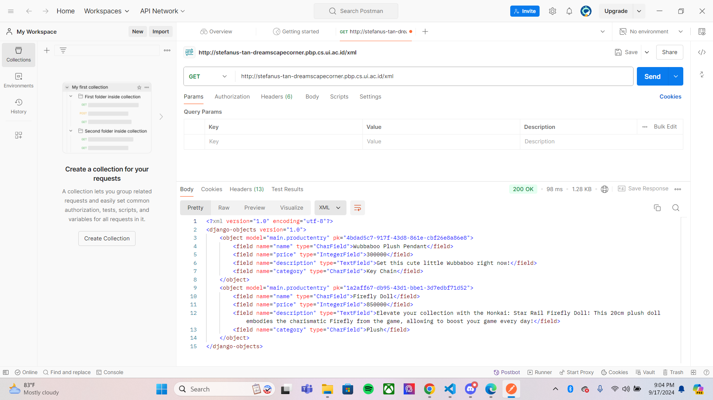

#  Dreamscape Corner
Dreamscape Corner adalah E-Commerce yang menyediakan produk merchandise dari Honkai: Star Rail. E-Commerce ini terinspirasi dari Honkai Shop yang juga menjual merchandise game yang sama. Nama "Dreamscape Corner" di ambil dari nama toko di dalam game bernama "Dreamscape Sales Store" yang terletak di Penacony.<br>
<br>
<br>
Dreamscape Corner dijalankan menggunakan Pacil Web Service (PWS) yang dapat diakses diakses melalui [link berikut.](http://stefanus-tan-dreamscapecorner.pbp.cs.ui.ac.id/ "Dreamscape Corner")<br>
<br>
<br>
Dibuat oleh,<br>
**Nama:** Stefanus Tan Jaya<br>
**NPM:** 2306152456<br>
**Kelas:** PBP D<br>
<br>
<br>

# Tugas
## Tugas Individu 4
### a. Perbedaan antara `HttpResponseRedirect()` dan `redirect()`
`HttpResponseRedirect()` adalah salah satu *method* untuk mengarahkan *user* ke URL yang dimasukkan (dalam hal ini pada `urls.py`) dengan membuat *response* HTTP. Dari pengertiannya, *method* ini hanya menerima URL yang ingin dituju saja. *Method* ini digunakan saat *response* yang akan diterima *user* berisi kontrol yang spesifik yang dapat *user* gunakan, seperti pengaturan *cookies*. Contoh pengaplikasiannya pada `login_user` di `views.py`. <br>

Meskipun fungsinya sama, `redirect()` lebih sederhana dan fleksibel daripada `HttpResponseRedirect()`. Selain itu, *method* ini dapat menerima URL, *view*, dan model. *Method* `redirect()` cocok digunakan saat *user* perlu berganti *views* atau *page* di *platform*. Contoh pengaplikasiannya pada `register` di `views.py`.

### b. Cara Kerja Penghubungan model `Product` dengan `User`
Penghubungan model `Product` dengan `User` diawali dengan command berikut pada `models.py`
```
from django.contrib.auth.models import User

class ProductEntry(models.Model):
    user = models.ForeignKey(User, on_delete=models.CASCADE)
    ···
```
Pada `Product` ditambah atribut `user` yang berisi informasi `User`. `User` ini direncanakan menjadi pemilik produk di *database*. Atribut `user` diisi *Foreign Key* yang berguna untuk membuat sebuah hubungan antara `Product` dengan `User`. Dengan begitu, satu `User` dapat membuat banyak `Product` dan banyak `Product` bisa dimiliki satu `User` di dalam *database* (*many-to-one relationship*). Ada parameter `on_delete=models.CASCADE` yang berarti jika data satu `User` dihapus di dalam *database*, maka semua `Product` yang dibuat atau dimilikinya juga ikut terhapus di *database*. 

### c. Perbedaan antara *authentication* dan *authorization* serta cara Django mengimplementasikan keduanya

### d. Cara Django mengingat pengguna yang telah login dan kegunaan *cookies*

### e. Proses Implementasi Autentikasi, Session, dan Cookies pada Django

## Tugas Individu 3
### a. Mengapa kita memerlukan Data Delivery dalam pengimplementasian sebuah platform?
*Data Delivery* perlu diimplementasikan ke dalam *platform* supaya data dapat dikirim, diterima, dan diakses dengan cepat, aman, dan efisien. Banyak *platform* yang memerlukan akses data secara *real-time* untuk memberikan pengalaman yang lancar kepada *user*. Selain itu, *Data Delivery* dapat menjaga integritas data selama proses transmisi dan meningkatkan kinerja sistem dengan menangani jumlah *user* dan data dalam jumlah yang besar. 

### b. XML atau JSON? Mengapa JSON lebih populer daripada XML?
Bagi saya, JSON lebih baik daripada XML karena formatnya berupa `key:value` yang mudah dibaca oleh *user* dan familiar bagi programmer. *Syntax* JSON lebih padat dan mudah ditulis ketimbang XML yang bertele-tele karena membutuhkan awal dan *end tag*. JSON juga lebih mudah di-*parse* dengan menggunakan JavaScript dan prosesnya lebih aman daripada XML.

### c. Apa fungsi method `is_valid` pada form Django dan mengapa kita membutuhkannya?
*Method* `is_valid` digunakan untuk memvalidasi isi *input* yang masuk ke *form* Django. Saat *form* diisi dan dikirim oleh *user*, method ini akan mengecek semua *field* berdasarkan aturan validasi yang diterapkan. Jika terpenuhi, *method* akan mengembalikan `True` dan sebaliknya, mengembalikan `False` bila ditemukan kesalahan.<br>

Kita butuh *method* `is_valid` untuk memastikan *input* yang diterima aman dan sesuai prosedur. Ingat pepatah, `"All input is evil until proven otherwise."` Kita dapat mengelola kesalahan *input* tersebut, memberikan umpan balik yang tepat, serta menjaga integritas dan keamanan sistem. 

### d. Mengapa kita membutuhkan `csrf_token` saat membuat form di Django? Apa yang dapat terjadi jika kita tidak menambahkan `csrf_token` pada form Django? Bagaimana hal tersebut dapat dimanfaatkan oleh penyerang?
`csrf_token` (Cross-Site Request Forgery) adalah salah satu fitur yang disediakan Django untuk memilah *request user* dan melindungi *platform* dari serangan CSRF. Ketika user telah terautentikasi dan menjelahi *platform*, Django akan me-*generate* token CSRF unik di tiap sesinya. Token ini membantu mencegah penyerang membuat formulir berbahaya yang dapat mengelabui *user*.<br>

Serangan CSRF adalah serangan siber yang mengeksploitasi *platform* kita dengan cara mengelabui *user* hingga tanpa sadar mengirim permintaan yang diinginkan penyerang. Biasanya penyerang mendapat akses autentikasi ke *platform* kita, kemudian memanipulasi akses dan perintah dalam *platform* tersebut. *User* yang baru masuk akan digiring mengikuti perintah tertentu dan penyerang akan mendapatkan informasi yang diinginkan.

### e. Proses Pembuatan Form Django dan Implementasi Fungsi Views
1. Membuat `forms.py` dalam direktori `main` yang menerima *entry* produk baru dengan atribut sesuai pada `models.py`.
    ```
    from django.forms import ModelForm
    from main.models import ProductEntry

    class ProductEntryForm(ModelForm):
        class Meta:
            model = ProductEntry
            fields = ["name", "category", "price", "description"]
    ```
2. Pada `views.py`, impor `form` dan `redirect`, kemudian buat fungsi `create_product_entry` untuk menampilkan `form` dalam bentuk HTML yang telah tersimpan pada *file* `create_product_entry.html` dalam direktori `templates`.
    ```
    def create_product_entry(request):
        form = ProductEntryForm(request.POST or None)

        if form.is_valid() and request.method == "POST":
            form.save()
            return redirect('main:show_main')

        context = {'form': form}
        return render(request, "create_product_entry.html", context)
    ```
3. Membuat 4 fungsi baru di `views.py` untuk mengembalikan data produk sesuai dengan format yang diimplementasikan.
    ```
    # Mengembalikan data dalam XML
    def show_xml(request):
        data = ProductEntry.objects.all()
        return HttpResponse(serializers.serialize("xml", data), content_type="application/xml")

    # Mengembalikan data dalam JSON
    def show_json(request):
        data = ProductEntry.objects.all()
        return HttpResponse(serializers.serialize("json", data), content_type="application/json")

    # Mengembalikan data berdasarkan ID dalam XML
    def show_xml_by_id(request, id):
        data = ProductEntry.objects.filter(pk=id)
        return HttpResponse(serializers.serialize("xml", data), content_type="application/xml")

    # Mengembalikan data berdasarkan ID dalam JSON
    def show_json_by_id(request, id):
        data = ProductEntry.objects.filter(pk=id)
        return HttpResponse(serializers.serialize("json", data), content_type="application/json")
    ```
4. Impor keempat fungsi tersebut dalam `urls.py` dan tambah *routing* URL ke `urlpatterns` supaya dapat diakses.
    ```
    ···
    path('xml/', show_xml, name='show_xml'),
    path('json/', show_json, name='show_json'),
    path('xml/<str:id>/', show_xml_by_id, name='show_xml_by_id'),
    path('json/<str:id>/', show_json_by_id, name='show_json_by_id'),
    ···
    ```

### f. Screenshot Postman
1. Format XML
    
2. Format JSON
    
3. Format XML by ID
    
4. Format JSON by ID
    

## Tugas Individu 2
### a. Proses Pembuatan Proyek Django
1. Membuat direktori baru bernama `dreamscape-corner` dan inisiasi repositori lokal di direktori tersebut dengan *command prompt* atau Visual Studio Code.
2. Membuat repositori di Github dan hubungkan dengan repositori lokal `dreamscape-corner`.
3. Membuat *virtual environment* baru dan aktifkan env tersebut.
4. Membuat *file* baru bernama `requirements.txt` yang berisi
    ```
    django
    gunicorn
    whitenoise
    psycopg2-binary
    requests
    urllib3
    ```
    dan *install requirements* tersebut.
5. Membuat proyek Django dengan
    ```
    django-admin startproject dreamscape_corner .
    ```
6. Melakukan penyesuaian di `settings.py` dalam direktori `dreamscape_corner` bersamaan dengan pembuatan file `.gitignore` dan *deployment* proyek Django ke Pacil Web Service (PWS).
7. Membuat aplikasi `main` dengan
    ```
    python manage.py startapp main
    ```
    lalu daftar `main` pada variabel `INSTALLED_APPS` di `settings.py` dalam direktori `dreamscape_corner`.
8. Membuat model `Product` di  `models.py` dalam direktori `main` dengan atribut
    ```
    name: CharField,
    price: IntegerField,
    description: TextField,
    category: CharField,
    ```
9. Membuat dan menjalankan migrasi model untuk menerapkannya ke dalam basis data lokal.
10. Membuat fungsi *view* `show_main` dalam `views.py` untuk menampilkan HTML bernama `main.html` yang telah dibuat di dalam direktori `templates` pada direktori `main`. 
11. Di dalam `main.html`, nantinya akan ditampilkan nama aplikasi, data dari `show_main`. serta identitas pembuat.
12. Membuat *file* `urls.py` di dalam direktori `main` untuk *routing* URL aplikasi `main`.
13. Melakukan penyesuaian di `urls.py` pada direktori `dreamscape_corner` untuk *routing* URL proyek.
14. Melakukan *push* kode ke GitHub dan menunggu PWS selesai *build* proyek.

### b. Bagan Request Client ke Django

+ `urls.py` akan memilah dan memilih *views* yang perlu dikembalikan ke *client* sesuai *request* yang dikirim.
+ `views.py` menyimpan pemrosesan data yang diminta pada *request* dari *client*. Hasil datanya dapat dikembalikan bersama dengan tampilan *web* dari `main.html`.
+ `main.html` mengembalikan *response* berupa tampilan *web* kepada *client* sesuai dengan *request* sebelumnya.
+ `models.py` menjembatani *database* dan *views* di mana bentuk model pada *database* akan disimpan di dalam `models.py`. Hubungannya dengan `views.py` adalah data akan diambil dan diproses dalam `views.py` untuk memenuhi request.

### c. Fungsi `git` pada Pengembangan Proyek Lunak
1. Riwayat Perubahan Lengkap<br>
    Sistem kontrol `git` dapat melacak setiap perubahan yang dilakukan pada setiap *file* seiring waktu, termasuk mencatat siapa yang membuat perubahan, kapan perubahan itu dilakukan, dan mengapa. Hal ini mencakup membuat dan menghapus file, serta mengedit kontennya. Dengan riwayat lengkap ini memungkinkan developer untuk kembali ke versi *file* sebelumnya, yang berguna untuk menemukan penyebab *bug*.<br>
    <br>
2. *Branching* dan *Merging*<br>
    Dalam sistem kontrol `git`, tim developer dapat mengerjakan berbagai bagian proyek secara bersamaan. Meskipun dalam komputer sendiri-sendiri, developer dapat mengerjakan bagian yang berbeda secara terpisah dengan cara membuat *branch*. Nantinya, developer dapat menggabungkan kembali bagian-bagian yang terpisah ini dengan fitur *merge*. Hal ini membantu memastikan bahwa perubahan yang dilakukan di setiap bagian tidak bertentangan satu sama lain.<br>
    <br>
3. *Open Source* dan Fleksibilitas<br>
    Sistem kontrol `git` dapat digunakan secara terbuka oleh siapa pun yang ingin mengembangkan proyeknya. Selain itu, `git` menjadi layanan *hosting* yang komprehensif dengan *platform* yang fleksibel, seperti Gitlab, GitHub, Bitbucket, dan SourceForge. *Platform* tersebut dapat digunakan sebagai solusi untuk *hosting* berbagai proyek.

### d. Mengapa Django menjadi pondasi dasar pengembangan perangkat lunak?
1. *Simple*<br>
    *Framework* Django telah dibuat untuk mudah digunakan dan mempercepat proses implementasi *software*. Django menyediakan *tools*, *components*, dan *liraries* yang membantu dalam pengembangan perangkat lunak yang sederhana.<br>
    <br>
2. Komunitas<br>
    Komunitas Django dipenuhi developer-developer informatif yang mendukung pengembangan *framework* ini. Mereka seringkali berbagi pengalaman, *best practices*, dan tutorial yang dapat membantu developer baru untuk belajar, mengembangkan *skill*, dan membangun aplikasi yang lebih baik.<br>
    <br>
3. Keamanan<br>
    Django menyediakan fitur yang dapat melindungi developer baru yang masih awam terhadap ancaman siber. Django dapat mengatasi serangan maupun ancaman web, seperti Cross-Site Scripting (XSS), Cross-Site Request Forgery (CSRF), and SQL Injection.<br>
    <br>
4. Dukungan Autentikasi<br>
    Django menyediakan fitur autentikasi dan autorisasi yang mendukung pembangunan perangkat lunak yang aman. Fitur ini termasuk kata sandi, pengaturan akses *user*, dan mendukung autentikasi dari pihak ketiga, seperti Google Sign-In.<br>
    <br>
5. Performa<br>
    Django memiliki kinerja performa yang bagus, sehingga cocok untuk *software* yang membutuhkan respon cepat. *Framework* ini memiliki struktur kode yang optimal dan fitur *caching* untuk mendukung performa.

### e. Mengapa model pada Django disebut sebagai ORM?
Model Django yang ORM (Object-Relational Mapper) memungkinkan deveoper untuk berinteraksi dengan *database*. ORM Django berfungsi untuk membuat SQL secara *pythonic* dengan mengambil dan memanipulasi data dari *database* developer. Kemudian, didapatkan hasil dengan gaya pemrograman Python yang mudah dipahami. Alhasil, kita tidak perlu menulis *query* SQL lagi jika ingin berinteraksi dengan database yang dikelola Django.